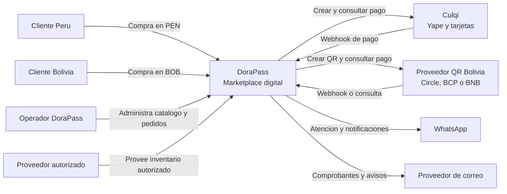
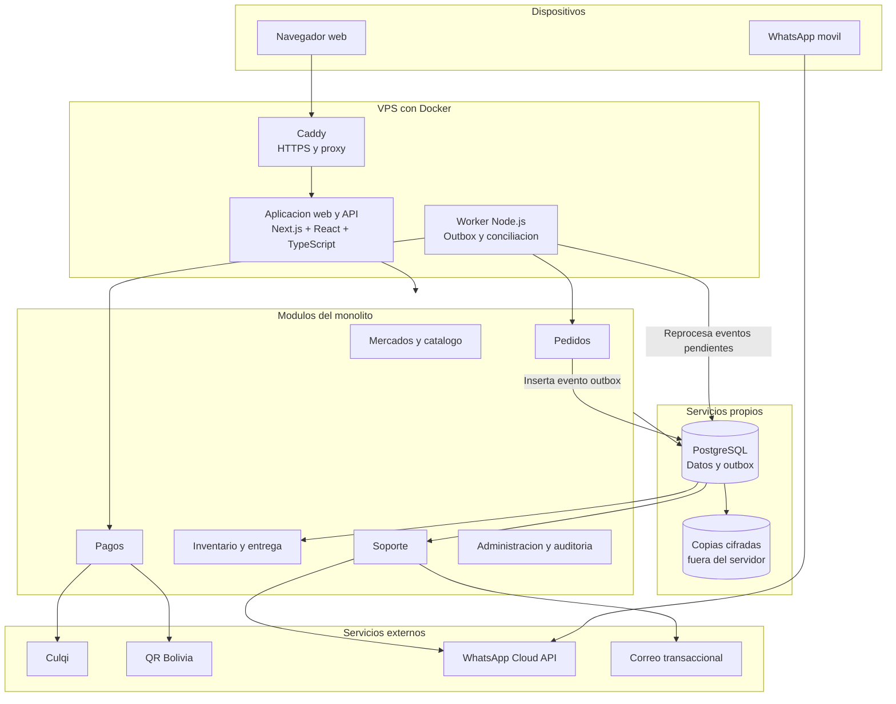
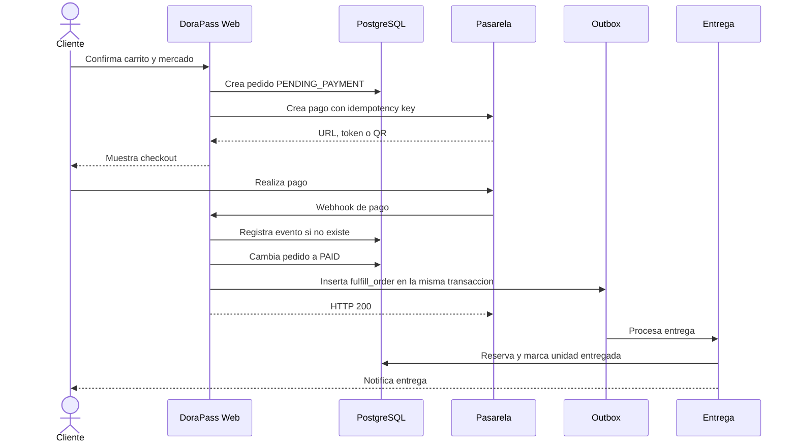
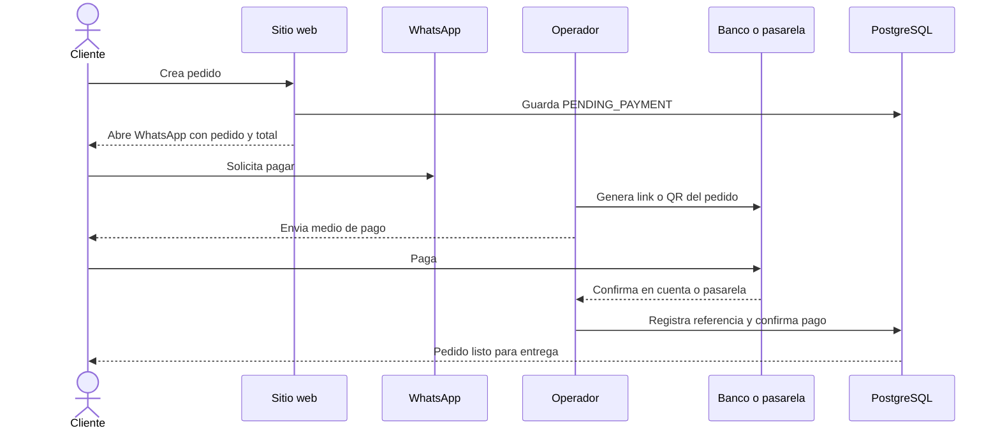
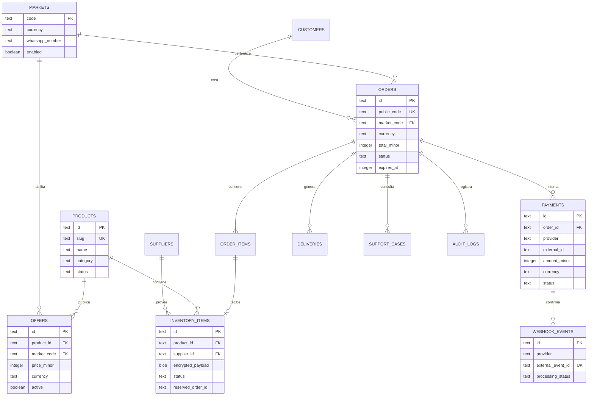

# DoraPass Peru y Bolivia

## Software Design Document (SDD)

**Estado:** Arquitectura recomendada para implementacion  
**Version:** 1.2  
**Fecha:** 2026-08-29  
**Alcance:** MVP comercial para Peru y Bolivia

---

## 1. Resumen ejecutivo

DoraPass sera un marketplace controlado de productos digitales autorizados para Peru y Bolivia. La primera version tendra un solo operador comercial: DoraPass publica el catalogo, cobra, verifica el pago y entrega el producto. La apertura a vendedores externos se realizara despues de validar pagos, conciliacion, soporte y devoluciones.

La arquitectura elegida es un **monolito modular construido a mano con Next.js estable, PostgreSQL y Drizzle ORM, desplegado con Docker**. No se usara Supabase ni otro backend como servicio. Esta decision conserva React, TypeScript y la interfaz del prototipo, mientras mantiene bajo nuestro control la base de datos, las sesiones, las migraciones y los procesos programados.

El sistema tendra dos rutas de cobro independientes:

- Peru: Culqi con Yape y tarjetas; CulqiLink como alternativa asistida.
- Bolivia: QR BCB mediante una pasarela o API bancaria; Yape/QR y WhatsApp como alternativa asistida.

Los proveedores de pago se conectaran mediante adaptadores. El resto del sistema no dependera directamente de Culqi, Circle, BCP o BNB.

## 2. Objetivos

### 2.1 Objetivos del MVP

- Mostrar un catalogo diferente para Peru y Bolivia.
- Manejar precios en PEN y BOB sin conversion automatica.
- Crear pedidos con identificadores unicos.
- Cobrar dentro de la web o continuar por WhatsApp.
- Confirmar pagos mediante webhook o verificacion bancaria real.
- Reservar y entregar codigos digitales una sola vez.
- Administrar catalogo, inventario, pedidos, pagos y reembolsos.
- Mantener trazabilidad completa de cambios sensibles.

### 2.2 Fuera del MVP

- Pagos divididos automaticamente entre vendedores.
- Billetera o saldo interno de clientes.
- Conversion de soles a bolivianos o viceversa.
- Aplicacion movil nativa.
- Suscripciones recurrentes cobradas por DoraPass.
- Publicacion automatica de vendedores sin revision.
- Almacenamiento o entrega de usuarios y contrasenas de streaming.

## 3. Principios de arquitectura

1. **Monolito modular primero:** una aplicacion desplegable, con modulos internos separados.
2. **Pagos desacoplados:** cada pais usa su propio adaptador.
3. **Confirmacion del servidor:** una captura nunca confirma un pago.
4. **Idempotencia:** webhooks y trabajos pueden repetirse sin entregar dos veces.
5. **Menor privilegio:** cada servicio accede solo a los datos necesarios.
6. **Dinero como enteros:** los importes se guardan en centimos, nunca como decimales flotantes.
7. **Datos por mercado:** cada pedido conserva pais, moneda, precio y proveedor de pago.
8. **Sin credenciales de terceros:** solo codigos autorizados o referencias de activacion.

## 4. Stack tecnologico

| Capa | Eleccion | Motivo |
|---|---|---|
| Lenguaje | TypeScript estricto | Un contrato de tipos para interfaz, servidor y proveedores |
| Interfaz | React 19 | Ya esta instalado en el prototipo |
| Framework web | Next.js estable, App Router | Ecosistema amplio, documentacion oficial y menor riesgo que Vinext beta |
| Estilos | Tailwind CSS 4 | Ya instalado y adecuado para el sistema visual existente |
| Componentes | shadcn + Base UI | Controles accesibles y consistentes ya disponibles |
| Iconos | Lucide React | Ya instalado |
| Formularios | React Hook Form + Zod | Formularios complejos y validacion compartida |
| Base de datos | PostgreSQL propio | Transacciones maduras, control total y migracion portable |
| Acceso a datos | Drizzle ORM + SQL versionado | Tipos seguros, migraciones legibles y acceso cercano a SQL |
| Autenticacion | Sesiones propias en PostgreSQL | Cookies seguras, sesiones revocables y ninguna dependencia de un BaaS |
| Archivos | Imagenes publicas versionadas; secretos cifrados en PostgreSQL | El MVP no necesita un servicio de archivos privado |
| Procesamiento asincrono | Patron transactional outbox | El evento y el cambio financiero se guardan en una sola transaccion |
| Tareas programadas | Proceso worker + cron | Reintenta eventos pendientes y ejecuta conciliaciones bajo nuestro control |
| Pagos Peru | Culqi | Yape, tarjetas, links y webhooks |
| Pagos Bolivia | Adaptador QR BCB | Circle o API bancaria segun contrato disponible |
| WhatsApp MVP | Enlace click-to-chat | Permite atencion humana sin una integracion compleja |
| WhatsApp fase 2 | WhatsApp Cloud API | Mensajes y estados integrados mediante webhooks |
| Pruebas unitarias | Vitest | Rapido y compatible con TypeScript |
| Pruebas de navegador | Playwright | Flujo completo de compra y administracion |
| Calidad | Oxlint + Oxfmt | Ya configurados en el repositorio |
| Despliegue | Docker Compose en VPS | Aplicacion y PostgreSQL reproducibles sin dependencia de plataforma |

### 4.1 Por que no mantener el stack actual

El prototipo actual usa Vinext beta, D1, R2 y una integracion especifica con Cloudflare. Es una combinacion eficiente para una demostracion, pero no es la opcion preferida para un sistema que manejara pagos durante varios anos:

- Vinext sigue siendo una dependencia beta y tiene una comunidad menor.
- D1 es una base SQLite distribuida con limites y un modelo operativo mas especifico.
- Encontrar desarrolladores con Next.js y PostgreSQL es mas sencillo.
- PostgreSQL facilita inventario concurrente, conciliacion y futuros vendedores.
- Next.js y PostgreSQL permiten construir el backend sin SDKs propietarios.
- El cambio es economico ahora porque la aplicacion todavia no tiene backend real.

### 4.2 Comparacion resumida

| Alternativa | Mantenimiento | Reutiliza el prototipo | Riesgo | Decision |
|---|---:|---:|---:|---|
| Vinext + D1 + Workers | Medio | Alto | Medio/alto por Vinext beta y dependencia de plataforma | No usar para produccion |
| Next.js + PostgreSQL + Docker | Alto | Alto | Medio por operacion propia | **Recomendada por decision del propietario** |
| Laravel + PostgreSQL | Muy alto | Medio/bajo | Bajo | Excelente si el equipo prefiere PHP |

Laravel seria una gran opcion si empezaramos desde cero o si el equipo responsable dominara PHP. Para este proyecto, Next.js y PostgreSQL conservan toda la interfaz React y permiten implementar el backend en el mismo lenguaje. El costo de esta independencia es que nosotros seremos responsables de actualizaciones, copias de seguridad, sesiones y monitoreo.

La migracion no desecha el trabajo visual. Se reutilizan `app/page.tsx`, los componentes React, Tailwind, shadcn, iconos y estilos. Cambian el scaffold, los scripts de ejecucion y la infraestructura de datos, que todavia no contiene informacion real.

### 4.3 Portabilidad

La logica de negocio vivira fuera de componentes y SDKs. PostgreSQL puede exportarse con herramientas estandar, Drizzle genera migraciones versionadas y los adaptadores de pagos no dependeran del hosting. La aplicacion podra moverse a otro VPS o proveedor sin redisenar catalogo, pedidos o pagos.

## 5. Arquitectura de contexto

**Tipo de diagrama:** C4, nivel de contexto.  
**Lectura principal:** clientes de dos paises usan una tienda; DoraPass coordina pagos, entrega y soporte.  
**Alternativa si Mermaid no se renderiza:** leer el diagrama como una lista de relaciones de izquierda a derecha.



## 6. Arquitectura de contenedores



## 7. Modulos del dominio

### 7.1 Markets

Responsable de las diferencias entre paises:

- Codigo de mercado: `PE` o `BO`.
- Moneda: `PEN` o `BOB`.
- Zona horaria de presentacion.
- Metodos de pago habilitados.
- Cuenta y proveedor de liquidacion.
- Numero de WhatsApp.
- Textos legales y politica de devolucion.

### 7.2 Catalog

- Productos y categorias.
- Ofertas por mercado.
- Precio, vigencia y disponibilidad.
- Informacion de activacion.
- Proveedores autorizados.

### 7.3 Inventory

- Codigos digitales cifrados.
- Estado disponible, reservado, entregado o invalidado.
- Fecha de reserva y vencimiento.
- Vinculo de cada unidad con un pedido.
- Importacion controlada y auditada.

### 7.4 Orders

- Carrito convertido en pedido.
- Snapshot de producto, precio, moneda y mercado.
- Estado de la compra.
- Reserva de inventario.
- Historial de transiciones.

### 7.5 Payments

- Intentos de pago.
- Adaptador Culqi.
- Adaptador QR Bolivia.
- Reclamos de pago manual.
- Webhooks e idempotencia.
- Reembolsos y conciliacion.

### 7.6 Fulfillment

- Verificacion de pago confirmado.
- Asignacion atomica de inventario.
- Entrega una sola vez.
- Notificacion al cliente.
- Reintentos seguros.

### 7.7 Support

- Enlace de WhatsApp con mensaje preparado.
- Casos asociados a un pedido.
- Comunicaciones de pago, entrega y reembolso.
- Plantillas por pais.

### 7.8 Admin

- Catalogo e inventario.
- Revision de pagos manuales.
- Pedidos y reembolsos.
- Proveedores.
- Reportes por mercado.
- Auditoria.

## 8. Flujo de pago automatico



### Reglas del webhook

- Verificar firma o autenticidad segun el proveedor.
- Guardar el identificador externo del evento con indice unico.
- Responder rapidamente y enviar el trabajo pesado al outbox.
- No confiar en estado, monto, moneda u order ID enviados por el navegador.
- Comparar el pago recibido con los valores almacenados en el pedido.
- Un evento repetido debe producir el mismo resultado sin doble entrega.

## 9. Flujo de pago por WhatsApp



Una captura puede adjuntarse como ayuda, pero no constituye confirmacion. El operador debe verificar el abono en la cuenta o panel del proveedor.

## 10. Estados

### 10.1 Pedido

```text
DRAFT
  -> PENDING_PAYMENT
  -> PAYMENT_REVIEW
  -> PAID
  -> FULFILLING
  -> DELIVERED
  -> COMPLETED

Salidas excepcionales:
CANCELLED, PAYMENT_EXPIRED, DELIVERY_FAILED,
REFUND_PENDING, REFUNDED
```

### 10.2 Pago

```text
CREATED -> PENDING -> CONFIRMED
                   -> FAILED
                   -> EXPIRED
CONFIRMED -> REFUND_PENDING -> REFUNDED
```

### 10.3 Unidad de inventario

```text
AVAILABLE -> RESERVED -> DELIVERED
          -> AVAILABLE, si vence la reserva
AVAILABLE/RESERVED -> VOID, si el codigo queda invalidado
```

## 11. Modelo de datos



### 11.1 Tablas principales

- `markets`
- `customers`
- `suppliers`
- `products`
- `offers`
- `inventory_items`
- `orders`
- `order_items`
- `payments`
- `manual_payment_claims`
- `webhook_events`
- `deliveries`
- `refunds`
- `support_cases`
- `audit_logs`

### 11.2 Convenciones de datos

- IDs internos: UUID generado por el servidor.
- Codigo visible: `PE-20260829-XXXX` o `BO-20260829-XXXX`.
- Dinero: `price_minor`, `total_minor`, `amount_minor`.
- Tiempo: UTC, representado como epoch de milisegundos.
- Borrado: estado inactivo para registros financieros; no borrado fisico.
- PII: minimizar, separar y no incluir en logs.

### 11.3 Indices iniciales

- Unico en `orders.public_code`.
- Compuesto en `orders(market_code, status, created_at)`.
- Compuesto en `payments(provider, external_id)`.
- Unico en `webhook_events(provider, external_event_id)`.
- Parcial para inventario disponible por producto.
- Compuesto en `audit_logs(entity_type, entity_id, created_at)`.

Los indices se confirmaran con consultas reales y `EXPLAIN (ANALYZE, BUFFERS)` en staging; no se agregaran indices especulativos.

## 12. Contrato del adaptador de pagos

```ts
interface PaymentProvider {
  createPayment(input: CreatePaymentInput): Promise<CreatedPayment>;
  parseWebhook(request: Request): Promise<VerifiedPaymentEvent>;
  getPaymentStatus(externalId: string): Promise<PaymentStatus>;
  refund(input: RefundInput): Promise<RefundResult>;
}
```

Implementaciones previstas:

- `CulqiPaymentProvider`
- `CirclePaymentProvider`
- `BankQrPaymentProvider`
- `ManualPaymentProvider`

La seleccion se realiza por mercado y configuracion, no mediante condicionales dispersos por la aplicacion.

## 13. API inicial

### Publica

- `GET /api/markets`
- `GET /api/catalog?market=PE`
- `GET /api/products/:slug?market=PE`
- `POST /api/orders`
- `GET /api/orders/:publicToken`
- `POST /api/orders/:id/payment-intents`
- `POST /api/orders/:id/manual-payment-claims`
- `POST /api/orders/:id/whatsapp-link`

### Webhooks

- `POST /api/webhooks/culqi`
- `POST /api/webhooks/bolivia/:provider`
- `POST /api/webhooks/whatsapp`

### Administracion

- `GET /api/admin/orders`
- `POST /api/admin/orders/:id/confirm-manual-payment`
- `POST /api/admin/orders/:id/refund`
- `POST /api/admin/products`
- `POST /api/admin/inventory/import`
- `GET /api/admin/reconciliation`

## 14. Estructura objetivo del repositorio

```text
app/
  [market]/
    page.tsx
    catalogo/
    producto/[slug]/
    checkout/[orderId]/
    pedido/[publicToken]/
  admin/
    pedidos/
    productos/
    inventario/
    conciliacion/
  api/
    orders/
    webhooks/
    admin/

components/
  ui/
  catalog/
  checkout/
  orders/
  admin/

server/
  modules/
    markets/
    catalog/
    inventory/
    orders/
    payments/
    fulfillment/
    support/
    admin/
  providers/
    payments/
    whatsapp/
    email/
  security/
  jobs/

db/
  client.ts
  schema/
  migrations/
  seed.ts
  queries/

lib/
  money.ts
  ids.ts
  validation.ts
  errors.ts

tests/
  unit/
  integration/
  e2e/

docs/
  SDD.md
  runbooks/
```

## 15. Seguridad

### 15.1 Pagos

- No almacenar numeros completos de tarjetas, CVV o claves de Yape.
- Llaves privadas solo como secretos del entorno.
- Validar firma de webhook cuando el proveedor la ofrezca.
- Confirmar monto, moneda, proveedor y pedido en el servidor.
- Usar claves de idempotencia en operaciones de pago.
- Separar credenciales de prueba y produccion.

### 15.2 Productos digitales

- No guardar contrasenas de cuentas de streaming.
- Cifrar codigos digitales con AES-GCM antes de almacenarlos.
- Mantener la llave de cifrado fuera de PostgreSQL.
- Mostrar el codigo solo al comprador autorizado.
- Registrar cada visualizacion o entrega.
- Impedir que una unidad se asigne a dos pedidos.

### 15.3 Administracion

- Superficie administrativa protegida con sesiones propias y MFA TOTP.
- Roles iniciales: `owner`, `operations`, `support`, `finance`.
- Toda confirmacion manual, reembolso o modificacion de inventario genera auditoria.
- Las acciones financieras no se autorizan solo desde el cliente.

### 15.4 Aplicacion

- Zod en todos los limites de entrada.
- Consultas preparadas.
- Proteccion CSRF donde aplique.
- Rate limiting para pedidos, consulta de estado y webhooks.
- Turnstile en formularios expuestos a abuso.
- Cabeceras CSP, HSTS, Referrer-Policy y Permissions-Policy.
- No registrar PII, secretos ni codigos entregables.

## 16. Autenticacion

### MVP

- Compra como invitado.
- El cliente recibe un enlace de pedido con token aleatorio no predecible.
- El token se almacena hasheado.
- Acciones sensibles requieren verificacion adicional por correo o WhatsApp.
- El panel administrativo usa sesiones propias con cookies `HttpOnly`, `Secure` y `SameSite=Strict`.
- Las contrasenas administrativas se almacenan con Argon2id y parametros versionados.
- El segundo factor TOTP es obligatorio para los roles administrativos.

### Fase posterior

- Cuenta opcional por correo con codigo de un solo uso.
- Historial de compras.
- Direcciones de contacto verificadas.
- Sesiones revocables.

La autenticacion se implementara en el servidor. Las tablas `admin_users`, `auth_sessions`, `mfa_factors` y `login_attempts` permitiran revocar sesiones, aplicar roles y auditar accesos. Durante el MVP solo los administradores tendran cuenta; las cuentas de compradores seguiran siendo opcionales.

## 17. Procesamiento asincrono

El MVP usara un **transactional outbox** en PostgreSQL. Cuando se confirma un pago, la misma transaccion actualiza el pedido e inserta un evento pendiente. Asi no puede existir un pedido pagado sin su trabajo de entrega.

Un worker Node.js procesara los eventos despues de que el webhook responda. Un cron del sistema verificara periodicamente eventos pendientes, pedidos vencidos y conciliaciones. Los eventos contienen IDs, no objetos completos ni datos sensibles.

Tipos iniciales:

- `fulfill_order`
- `send_order_confirmation`
- `send_delivery_notification`
- `reconcile_payment`
- `expire_order`
- `process_refund_notification`

Cada evento tendra un `event_id` unico, numero de intentos, proxima fecha de reintento y estado. Todos los consumidores seguiran siendo idempotentes. Si el volumen lo exige, se podra incorporar una cola dedicada sin cambiar los modulos de negocio.

## 18. Manejo de fallos

| Fallo | Comportamiento |
|---|---|
| Pasarela no responde al crear pago | Pedido permanece pendiente y permite reintentar |
| Webhook repetido | Se reconoce, pero no se vuelve a entregar |
| Webhook invalido | Se rechaza y registra sin cambiar el pedido |
| Pago confirmado sin inventario | Pedido pasa a `DELIVERY_FAILED` y alerta operaciones |
| Procesamiento asincrono falla | Outbox reintenta; despues pasa a revision operativa |
| WhatsApp no disponible | Correo y pagina de estado permanecen disponibles |
| Cliente paga pedido vencido | Revision y conciliacion manual |
| Diferencia de monto o moneda | `PAYMENT_REVIEW`, nunca entrega automatica |

## 19. Observabilidad

- Logs estructurados con `request_id`, `order_id`, `payment_id` y proveedor.
- Metricas de conversion, pagos fallidos, tiempo de entrega y reembolsos.
- Alertas por webhook fallido, inventario agotado y eventos outbox bloqueados.
- Panel operativo con estado de ultima conciliacion.
- Eventos de negocio separados de logs tecnicos.

Indicadores iniciales:

- Conversion de checkout.
- Tasa de confirmacion por proveedor.
- Tiempo pago-confirmado a entregado.
- Porcentaje de revision manual.
- Reclamos y reembolsos.
- Diferencias de conciliacion.

## 20. Requisitos no funcionales

- Interfaz responsive desde 360 px.
- Funciones esenciales accesibles por teclado.
- No depender de hover para acciones criticas.
- Respuesta del webhook rapida; procesamiento posterior mediante outbox.
- Entrega normal en menos de 60 segundos despues de pago confirmado.
- Recuperacion segura ante reintentos y eventos fuera de orden.
- Pagina de pedido util aun si WhatsApp esta caido.

## 21. Entornos y despliegue

### Desarrollo

- PostgreSQL local mediante Docker Compose.
- Proveedores de pago simulados.
- Datos ficticios.
- Ninguna llave real.

### Staging

- Base y almacenamiento separados.
- Llaves de prueba de pasarelas.
- Webhooks publicos de prueba.
- Pruebas E2E antes de cada lanzamiento.

### Produccion

- Llaves live administradas como secretos.
- Dominio propio y HTTPS.
- PostgreSQL propio con copias de seguridad automaticas, cifradas y probadas mediante restauracion.
- Contenedores de aplicacion, worker, PostgreSQL y proxy HTTPS.
- Outbox con reintentos y alertas de eventos bloqueados.
- Alertas y conciliacion programada.

## 22. Estrategia de pruebas

### Unitarias

- Calculo de totales.
- Transiciones de estado.
- Seleccion de proveedor por mercado.
- Validacion de webhook.
- Idempotencia.
- Reserva de inventario.

### Integracion

- Pedido, pago y outbox en PostgreSQL.
- Webhook repetido.
- Pago con importe incorrecto.
- Entrega unica.
- Expiracion y liberacion de inventario.

### E2E

- Compra Peru con proveedor simulado.
- Compra Bolivia con QR simulado.
- Continuar por WhatsApp.
- Pago rechazado.
- Pedido pagado y entregado.
- Confirmacion manual por administrador.
- Vista movil y teclado.

## 23. Plan de implementacion

### Fase 0: preparacion comercial

- Confirmar nombre, dominio y entidad operadora.
- Afiliar Culqi.
- Elegir proveedor QR en Bolivia.
- Conseguir contratos o facturas de proveedores autorizados.
- Definir politicas de entrega y devolucion.

### Fase 1: base tecnica

- Migrar el scaffold de Vinext/Sites a Next.js estable.
- Conservar componentes, estilos y experiencia visual existentes.
- Configurar Docker Compose y los entornos de desarrollo, staging y produccion.
- Refactorizar el prototipo en rutas y componentes.
- Crear PostgreSQL, el esquema Drizzle y las migraciones versionadas.
- Implementar mercados PE/BO.
- Catalogo real y panel administrativo minimo.

**Avance de la fase 1 (29 de agosto de 2026):**

- Completado: migracion del scaffold a Next.js 16.3.3, React 19.2.8 y TypeScript.
- Completado: sustitucion de Vite/Vinext y del enlace de hosting de Sites por la configuracion estandar de Next.js.
- Completado: preservacion de la interfaz existente y compilacion de produccion verificada.
- Pendiente: separar la interfaz en rutas y componentes de dominio.
- Completado: esquema Drizzle para mercados, categorias, productos, precios e inventario cifrable.
- Completado: migracion SQL inicial y semilla idempotente para PE/PEN y BO/BOB.
- Completado: Docker Compose local aislado en `127.0.0.1:55433`.
- Completado: migracion y semilla aplicadas en PostgreSQL local; verificados 6 productos para PE/PEN y 6 para BO/BOB.
- Resuelto: el reinicio Docker Desktop/WSL `0xc00000fd` era provocado por falta critica de espacio en `C:` y un archivo de paginacion reducido. Se liberaron temporales y cache regenerable, se reinicio Docker sin borrar volumenes y se verifico bajo carga.
- Pendiente: configurar Docker, el VPS y las credenciales de los entornos.

### Fase 2: pedidos y WhatsApp

- Carrito persistente.
- Creacion de pedidos.
- Reserva de inventario.
- Enlace de WhatsApp con mensaje preparado.
- Confirmacion manual auditada.

### Fase 3: Culqi Peru

- Checkout de prueba.
- Webhook.
- Conciliacion.
- Reembolsos.
- Pruebas con Yape y tarjetas.

### Fase 4: pagos Bolivia

- Integracion con Circle o API bancaria seleccionada.
- QR por pedido.
- Confirmacion automatica o consulta segura.
- Conciliacion bancaria.

### Fase 5: entrega y operaciones

- Outbox de entregas y reintentos.
- Codigos cifrados.
- Notificaciones.
- Alertas y dashboard.
- Pruebas de recuperacion.

### Fase 6: marketplace

- Alta y verificacion de vendedores.
- Ofertas por vendedor.
- Comisiones.
- Liquidaciones manuales auditadas.
- Pagos divididos solo cuando exista soporte legal y de pasarela.

## 24. Criterios para abrir a produccion

- Afiliacion aprobada por ambas rutas de pago.
- Catalogo respaldado por proveedores autorizados.
- Webhooks probados con eventos validos, invalidos y repetidos.
- Ninguna doble entrega en pruebas de concurrencia.
- Reembolso probado.
- Conciliacion diaria documentada.
- Panel administrativo protegido con MFA.
- Politicas legales visibles.
- Pruebas E2E criticas en verde.
- Procedimiento de incidente y soporte disponible.

## 25. Decisiones registradas

### ADR-001: monolito modular

Se elige una sola aplicacion desplegable. Los modulos internos conservan fronteras claras y pueden separarse mas adelante si aparece una necesidad real.

### ADR-002: PostgreSQL y backend propio

PostgreSQL sera la fuente de verdad. La aplicacion administrara el acceso a datos, las sesiones, los roles y el MFA mediante codigo propio y migraciones Drizzle. No se utilizara Supabase ni otro BaaS. Esta independencia exige mantener actualizaciones, copias de seguridad y monitoreo documentados.

### ADR-003: pago por adaptadores

Culqi y los proveedores bolivianos implementaran el mismo contrato interno. Cambiar un proveedor no debe modificar pedidos, inventario o entrega.

### ADR-004: compra invitada primero

La cuenta de cliente no es necesaria para validar el negocio. Se usaran enlaces de pedido firmados y verificacion de contacto.

### ADR-005: transactional outbox

El webhook confirma el pago e inserta un evento en la misma transaccion. La entrega no ocurre dentro de la solicitud del webhook y un worker propio recupera eventos pendientes.

### ADR-006: marketplace por etapas

El MVP opera con inventario controlado por DoraPass. Los vendedores externos se habilitaran cuando conciliacion, fraude y soporte esten estabilizados.

## 26. Preguntas que no bloquean el desarrollo inicial

- Cual es el banco de Peru que recibira liquidaciones.
- Cual es el banco de Bolivia y si ofrece API QR empresarial.
- Si Circle aprueba el rubro y condiciones comerciales.
- Numero de WhatsApp unico o uno por pais.
- Proveedor de correo transaccional.
- Reglas tributarias y comprobantes requeridos por cada entidad operadora.

Estas respuestas afectan configuracion e integraciones, pero no cambian la arquitectura principal.

## 27. Referencias oficiales

- [Yape: integracion de compras por internet](https://www.yape.com.pe/preguntas-frecuentes/enviar-y-recibir-yapeos/como-puedo-tener-la-opcion-de-compras-por-internet-codigo-de-aprobacion-yape-en-l)
- [Culqi: webhooks](https://docs.culqi.com/es/documentacion/pagos-online/webhooks/)
- [Culqi: ordenes de pago](https://docs.culqi.com/es/documentacion/pagos-online/ordenes-de-pago/resumen/)
- [Banco Central de Bolivia: QR interoperable](https://www.bcb.gob.bo/?q=node%2F232777)
- [BCP Bolivia: APIs QR](https://www.bcp.com.bo/Desarrollo/ApiPagosQR)
- [BNB: APIs QR Simple](https://www.bnb.com.bo/PortalBNB/Api/AllApis)
- [Circle Bolivia](https://circle.bo/)
- [Next.js: App Router](https://nextjs.org/docs/app)
- [PostgreSQL: documentacion](https://www.postgresql.org/docs/)
- [Drizzle ORM: documentacion](https://orm.drizzle.team/docs/overview)
- [Docker Compose: documentacion](https://docs.docker.com/compose/)
- [OWASP: autenticacion](https://cheatsheetseries.owasp.org/cheatsheets/Authentication_Cheat_Sheet.html)
- [OWASP: gestion de sesiones](https://cheatsheetseries.owasp.org/cheatsheets/Session_Management_Cheat_Sheet.html)
- [WhatsApp Cloud API, coleccion oficial de Meta](https://www.postman.com/meta/whatsapp-business-platform/documentation/wlk6lh4/whatsapp-cloud-api)
